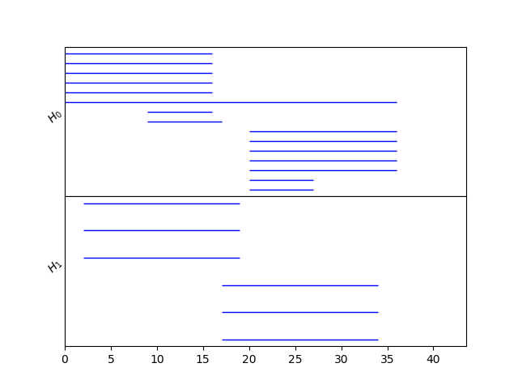

# Cubical Complexes

In this example, we'll now see how to create cubical complexes using toplices, and how to compute a zigzag diagram through levelsets of an image.

```python
import bats
import numpy as np
import matplotlib.pyplot as plt
```

## Cubical Complexes

In BATS, cubical complexes are given a maximal dimension.

```python
X = bats.CubicalComplex(3) # 3 = max dimension
```

maximum dimension cubes are defined by a list of length `2*d`, where `d` is the dimension
```python
[0,1,1,2,0,1] # cube (0,1) x (1,2) x (0,1)
```

lower dimensional cubes have degeneracies, but are still a list of length `2*d`
```python
[0,0,1,2,1,1] # cube (0) x (1,2) x (1)
```

## Toplex

A toplex is a complex described by maximum dimension cells.  All faces that must exist exist.  Cubical complexes can be created by adding these top-level cells.

```python
X.add_recursive([0,1,0,1,0,1]) # adds cube (0,1) x (0,1) x (0,1)
print(X.ncells()) # 27
```

## Image Levelset Zigzag

Images are a common way to obtain cubical complexes.  Let's generate one.

```python
# generate image
m = 100
n = 100
A = np.empty((m,n))
for i in range(m):
    for j in range(n):
        A[i,j] = np.sin(i/10) * np.cos(j/10)
plt.imshow(A)
```


We'll zigzag through cubical complexes defined by level sets and their unions:

```python
lsets = [[x/10, (x+2)/10] for x in range(-10,9,1)]
```

We'll operate on boolean images which indicate the support of each level set.  The first thing to do is to compute top-level cubes from these images
```python
def to_toplexes(A):
    """
    Create list of toplexes from boolean array A

    assume 2-dimensional for now
    """
    dims = A.shape
    toplex_list = []
    for i in range(dims[0]-1):
        for j in range(dims[1]-1):
            if (A[i,j] and A[i+1,j] and A[i,j+1] and A[i+1,j+1]):
                toplex_list.append([i,i+1,j,j+1])

    return toplex_list
```

Then we turn this list of cubes into a complex
```python
def image_to_complex(A):
    """
    Create cubical complex from boolean image A
    """
    toplex_list = to_toplexes(A)
    X = bats.CubicalComplex(2)
    for t in toplex_list:
        X.add_recursive(t)
    return X
```

Let's now create our diagram of complexes:
```python
# create diagram of cubical complexes
D = bats.CubicalComplexDiagram()
for i in range(len(lsets)):
    lb = lsets[i][0]
    ub = lsets[i][1]
    AL = np.logical_and(lb < A, A < ub)
    ii = D.add_node(image_to_complex(AL))

    if i != 0:
        # add edge to previous union
        D.add_edge(ii, ii-1, bats.CubicalMap(D.node_data(ii), D.node_data(ii-1)))

    if i != len(lsets)-1:
        # add node for union
        ub = lsets[i+1][1]
        AL = np.logical_and(lb < A, A < ub)
        D.add_node(image_to_complex(AL))

        # add edge to union
        D.add_edge(ii, ii+1, bats.CubicalMap(D.node_data(ii), D.node_data(ii+1)))
```

And we can compute the zigzag barcode:
```python
FD = bats.Chain(D, bats.F2()) # F2 coefficients

ps = []
for hdim in range(2):
    RD = bats.Hom(FD, hdim)
    ps.extend(bats.barcode(RD, hdim))

fig, ax = bats.visualization.persistence_barcode(ps)
```


## Filtered Cubical Complexes

We'll now look at computing persistent homology on the image from before


The idea is to filter toplexes by the largest pixel value

```python
def to_filtered_toplexes(A):
    """
    Create list of toplexes from array A

    assume 2-dimensional for now
    """
    dims = A.shape
    toplex_list = []
    for i in range(dims[0]-1):
        for j in range(dims[1]-1):
            t = max(A[i,j], A[i+1,j],A[i,j+1],A[i+1,j+1])
            toplex_list.append((t,[i,i+1,j,j+1]))

    return toplex_list
```

We can then create a filtered cubical complex
```python
def image_to_filtration(A):
    """
    Create cubical complex from boolean image A
    """
    toplex_list = to_filtered_toplexes(A)
    toplex_list = sorted(toplex_list)
    X = bats.FilteredCubicalComplex(2)
    for t, s in toplex_list:
        X.add_recursive(t, s)
    return X
```

To put everything together:
```python
X = image_to_filtration(A)
C = bats.FilteredF2ChainComplex(X)
R = bats.reduce(C)
ps = R.persistence_pairs(0) + R.persistence_pairs(1)

for p in ps:
    if p.length() > 0.1:
        print(p)
```
yields the following output
```
0 : (-0.996841,inf) <0,-1>
0 : (-0.995794,0.0029413) <4,9802>
0 : (-0.99572,0.00345711) <8,9812>
0 : (-0.994674,0.00268533) <12,9796>
0 : (-0.99272,0.0014712) <16,9770>
0 : (-0.991188,0.00242617) <20,9789>
0 : (-0.365212,0.00216782) <2463,9779>
0 : (-0.364648,0.00219438) <2470,9783>
1 : (0.00363827,0.999058) <9817,9790>
1 : (0.00382229,0.9988) <9821,9784>
1 : (0.0998193,0.999432) <11671,9794>
1 : (0.930355,0.999616) <19275,9800>
```
