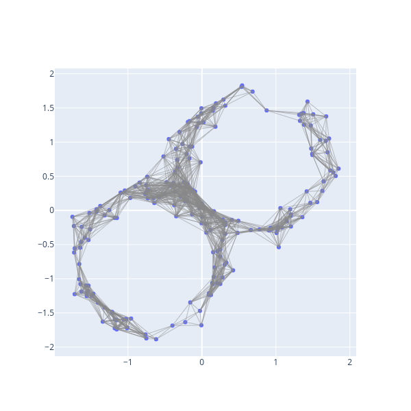
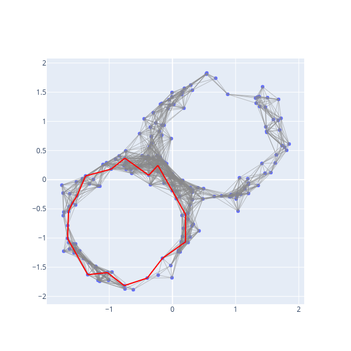
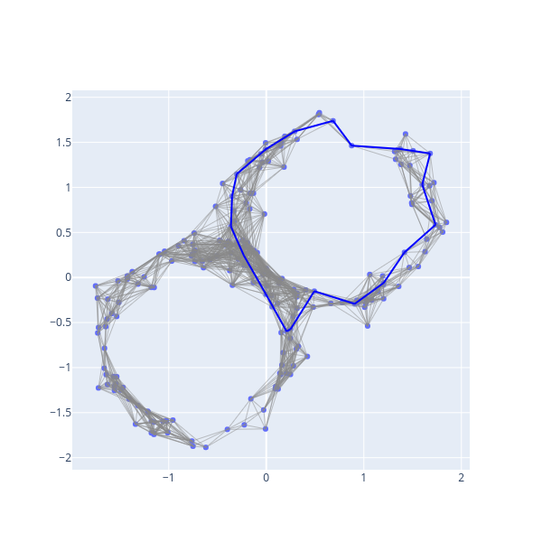

# Visualization

## Visualization of Simplicial Complexes and Generators

In this section, we'll visualize simplicial complexes using [plotly](https://plotly.com/python/).

```python
import numpy as np
import bats
from bats.visualization.plotly import ScatterVisualization
import scipy.spatial.distance as distance

np.random.seed(0)
```

Let's generate a figure-8 as a data set.
```python
def gen_fig_8(n, r=1.0, sigma=0.1):
    X = np.random.randn(n,2)
    X = r * X / np.linalg.norm(X, axis=1).reshape(-1,1)
    X += sigma*np.random.randn(n, 2) + np.random.choice([-1/np.sqrt(2),1/np.sqrt(2)], size=(n,1))
    return X

n = 200
X = gen_fig_8(n)
```

First, we'll construct a Rips complex on the data.
```python
pdist = distance.squareform(distance.pdist(X, 'euclidean'))

R = bats.RipsComplex(bats.Matrix(pdist), 0.5, 2)
fig = ScatterVisualization(R, pos=X)
fig.update_layout(width=600, height=600, showlegend=False)
fig.show()
```


A `ScatterVisualization` object inherits from a plotly `Figure`, so you can add additional traces, update layout, or call any methods you'd like.

Now, let's visualize generators
```python
fig.show_generators(1)
fig.show()
```


Let's now look at a single generator:

```python
fig.reset() # resets figure to have no generators
fig.show_generator(0, hdim=1, color='red')
fig.show()
```


Let's visualize the second generator by passing in the representative 1-chain:
```python
RC = bats.ReducedChainComplex(R, bats.F2())
r = RC.get_preferred_representative(1, 1)
fig.reset()
fig.show_chain(r, color='blue')
fig.show()
```



## Visualization of Maps

You can visualize a `SimplicialMap` with a `MapVisualization`.

```python
import numpy as np
import bats
from bats.visualization.plotly import MapVisualization
import scipy.spatial.distance as distance

np.random.seed(0)
```

Let's generate a cylinder in three dimensions:
```python
def gen_cylinder(n, r=1.0, sigma=0.1):
    X = np.random.randn(n,2)
    X = r * X / np.linalg.norm(X, axis=1).reshape(-1,1)
    X = np.hstack((X, r*np.random.rand(n,1) - r/2))
    return X

X = gen_cylinder(500)
```

We'll generate a Rips Complex with parameter `0.25`
```python
pdist = distance.squareform(distance.pdist(X, 'euclidean'))
R = bats.RipsComplex(bats.Matrix(pdist), 0.25, 2)
```

Let's investigate the inclusion of the lower half of the cylinder
```python
inds = np.where(X[:,2] < 0)[0]
Xi = X[inds]
pdisti = distance.squareform(distance.pdist(Xi, 'euclidean'))
Ri = bats.RipsComplex(bats.Matrix(pdisti), 0.25, 2)
```

The inclusion map is
```python
M = bats.SimplicialMap(Ri, R, inds)
```

Now, we can construct a visualization
```python
fig = MapVisualization(pos=(Xi,X), cpx=(Ri,R), maps=(M,))
fig.update_layout(scene_aspectmode='manual',
                  scene_aspectratio=dict(x=1, y=1, z=0.5))
fig.show()
```
<!-- [First Map](figures/map0.html ':include width=100% height=600px') -->
 <iframe src="../_static/map0.html" height="600" width="100%" title="First Map"></iframe>

The `show_generator` method will visualize homology generators in the domain by visualizing the preferred representative used in calculations.  By default, the image of the chain is visualized in the range, as well as the preferred representative for the homology class.

```python
fig.reset()
fig.show_generator(1)
fig.show()
```
<!-- [Generator](figures/map_gen.html ':include width=100% height=600px') -->
<iframe src="../_static/map_gen.html" height="600" width="100%" title="Generator"></iframe>

The `reset` method clears the visualization of chains/generators.  You can also change the color of chains and homology.  `group_suffix` can be used to group visualizations in the legend - try using the legend to toggle visualizations below:
```python
fig.reset()
fig.show_generator(5, group_suffix=0)
fig.show_generator(3, color='orange', hcolor='black', group_suffix=1)
fig.show()
```
<!-- [Generators](figures/map_gen2.html ':include width=100% height=600px') -->
 <iframe src="../_static/map_gen2.html" height="600" width="100%" title="Generators"></iframe>

Let's now create a second map from the full data set to a projection onto two coordinates.
```python
Xp = X[:,:2]
pdistp = distance.squareform(distance.pdist(Xp, 'euclidean'))
Rp = bats.RipsComplex(bats.Matrix(pdistp), 0.25, 2)
M2 = bats.SimplicialMap(R, Rp) # inclusion map
```

We can visualize the three spaces, with the maps between them, and mix 2-dimensional and 3-dimensional visualizations.  Note that the homology class visualized in `show_generator(1)` is killed by the second map.

```python
fig = MapVisualization(pos=(Xi,X, Xp), cpx=(Ri,R,Rp), maps=(M,M2))
fig.update_layout(scene_aspectmode='manual',
                  scene_aspectratio=dict(x=1, y=1, z=0.5))
fig.show_generator(1, color='green', hcolor='black', group_suffix=1)
fig.show_generator(5, color='red', hcolor='blue', group_suffix=5)
fig.show()
```

<!-- [Generators](figures/map_gen3.html ':include width=100% height=600px') -->
<iframe src="../_static/map_gen3.html" height="600" width="100%" title="Genertors"></iframe>
