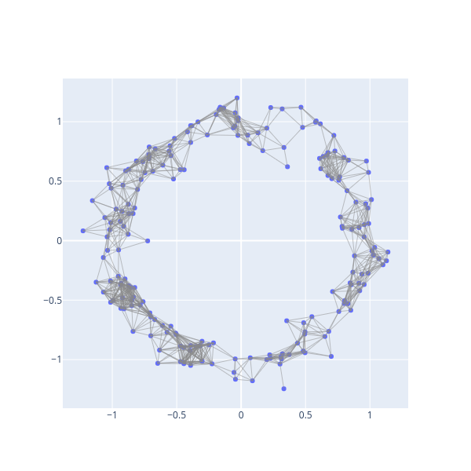
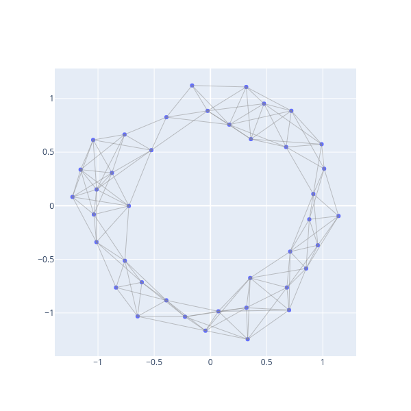

# Maps

## Topological Maps
All topological constructions use `bats.CellularMap` to represent topological maps.

To specify a `CellularMap`, you need to provide a map for cells in each dimension.  These should be stored as `bats.IntMat`, which provide oriented boundaries.  First let's define a `CellComplex` representing the circle with 2 vertices and 2 edges.


```python
import numpy as np
import bats

X = bats.CellComplex()
X.add_vertices(2)
X.add([0,1],[-1,1],1)
X.add([0,1],[1,-1],1)
```

We can verify that `X` has the expected betti numbers mod-2

```python
X2 = bats.Chain(X, bats.F2())
R2 = bats.ReducedF2ChainComplex(X2)
print(R2.hdim(0), R2.hdim(1)) # 1, 1
```

Now, we'll define a map from the cell complex to itself, via a doubling.  Each vertex maps to (0), and each edge maps to the sum of edges

```python
import scipy.sparse as sparse
M = bats.CellularMap(1)
M0_dense = np.array([[1,1],[0,0]])
A = sparse.csc_matrix(M0_dense)
M[0] = bats.Mat(bats.CSCMatrix(*A.shape, A.indptr, A.indices, A.data))
M1_dense = np.array([[1,1],[1,1]])
A = sparse.csc_matrix(M1_dense)
M[1] = bats.Mat(bats.CSCMatrix(*A.shape, A.indptr, A.indices, A.data))
```

`M` now contains the map that we want to represent.  We can now apply the chain functor

```python
M2 = bats.Chain(M, bats.F2())
```

And to compute induced maps, we need to supply a `ReducedChainComplex` for both the domain and range of the map.  We computed these above.  The output is a `bats` column matrix.

```python
for dim in range(2):
    Mtilde = bats.InducedMap(M2, R2, R2, dim)
    print(Mtilde.tolist()) # [[1]], [[0]]
```

Note the doubling map on the circle creates the zero map on H1.

## Algorithmic Constructions

There are a variety of common situations in which a `CellularMap` can be constructed algorithmically.  `bats` provides a `SimplicialMap` and `CubicalMap` for `SimplicialComplex` and `CubicalComplex` types.

### SimplicialMap

A simplicial map $f$ is extended from a map on zero-cells of simplicial complexes.  Let's create a noisy circle data set for example.

```python
import numpy as np

def gen_circle(n, r=1.0, sigma=0.1):
    X = np.random.randn(n,2)
    X = r * X / np.linalg.norm(X, axis=1).reshape(-1,1)
    X += sigma*np.random.randn(n, 2)
    return X

np.random.seed(0)

X = gen_circle(200)
```

Now we'll create a `SimplicialComplex` using the Rips construction

```python
from bats.visualization.plotly import ScatterVisualization
import scipy.spatial.distance as distance

pdist = distance.squareform(distance.pdist(X, 'euclidean'))

R = bats.RipsComplex(bats.Matrix(pdist), 0.25, 2)
fig = ScatterVisualization(R, pos=X)
fig.update_layout(width=600, height=600, showlegend=False)
fig.show()
```


We now can create an inclusion map (identity map) via

```python
f = bats.SimplicialMap(R, R)
```

Now, we can compute the induced map on homology to see we get the identity on H1:
```python
R2 = bats.ReducedChainComplex(R, bats.F2())
F2 = bats.Chain(f, bats.F2())
Ftil = bats.InducedMap(F2, R2, R2, 1)
Ftil.tolist() #  [[1, 0], [0, 1]]
```

Let's now do a non-inclusion `SimplicialMap`.  We'll get a greedy cover of the data, and threshold to `k` points.

We'll construct a new Rips complex, where the parameter is increased by twice the Hausdorff distance to the full set.

```python
k = 40
inds, dists = bats.greedy_landmarks_hausdorff(bats.Matrix(pdist), 0)
inds = inds[:k]
eps = dists[k-1]
eps # hausdorff distance from subset to total data set

Xk = X[inds]
pdist_k = np.array(pdist[inds][:,inds], copy=True)
Rk = bats.RipsComplex(bats.Matrix(pdist_k), 0.25 + 2*eps, 2)
fig = ScatterVisualization(Rk, pos=Xk)
fig.update_layout(width=600, height=600, showlegend=False)
fig.show()
```


We'll now define a map from the full data set to the sub-sampled data by sending points to their nearest neighbor

```python
from scipy.spatial import cKDTree
tree = cKDTree(Xk)
ds, f0 = tree.query(X, k=1)
```

`f0` is now the map for vertices of `R` to vertices of `Rk`.  We can extend the map

```python
f = bats.SimplicialMap(R, Rk, f0)
```

Now, we can go through the process of computing the induced map on homology

```python
Rk2 = bats.ReducedChainComplex(Rk, bats.F2())
F2 = bats.Chain(f, bats.F2())
Ftil = bats.InducedMap(F2, R2, Rk2, 1)
Ftil.tolist() # [[0, 1]]
```
We see the small H1 generator is killed.

We can visualize this (See [visualization](tutorials/visualization?id=visualization-of-maps) for details).

```python
from bats.visualization.plotly import MapVisualization
fig = MapVisualization(pos=(X, Xk), cpx=(R, Rk), maps=(f,))
fig.show_generator(0, color='green', group_suffix=0)
fig.show_generator(1, color='red', group_suffix=1)
fig.show()
```

[Generator](figures/map_circle_vis.html ':include width=100% height=600px')

### CubicalMap

Right now, `bats.CubicalMap` only supports inclusions - syntax is the same as that for `bats.SimplicialMap`, but inputs are `bats.CubicalComplex` objects.
