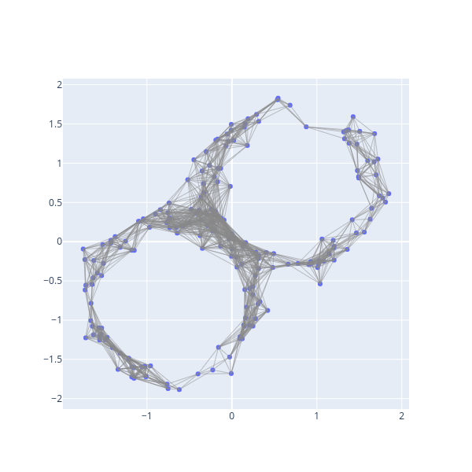
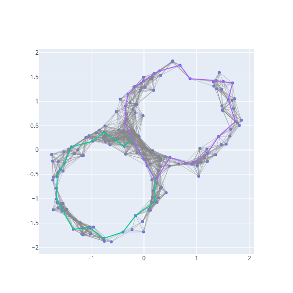
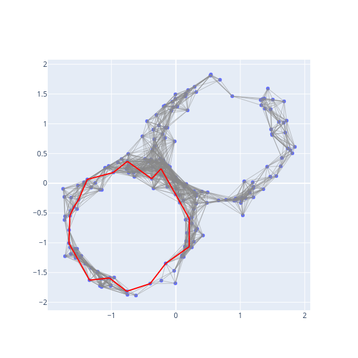

# Visualization

## Visualization of Simplicial Complexes and Generators

In this section, we'll visualize simplicial complexes using [plotly](https://plotly.com/python/).

```python
import numpy as np
import bats
from bats.visualization.plotly import ScatterVisualization
import scipy.spatial.distance as distance

np.random.seed(0)
```

Let's generate a figure-8 as a data set.
```python
def gen_fig_8(n, r=1.0, sigma=0.1):
    X = np.random.randn(n,2)
    X = r * X / np.linalg.norm(X, axis=1).reshape(-1,1)
    X += sigma*np.random.randn(n, 2) + np.random.choice([-1/np.sqrt(2),1/np.sqrt(2)], size=(n,1))
    return X

n = 200
X = gen_fig_8(n)
```

First, we'll construct a Rips complex on the data.
```python
pdist = distance.squareform(distance.pdist(X, 'euclidean'))

R = bats.RipsComplex(bats.Matrix(pdist), 0.5, 2)
fig = ScatterVisualization(R, pos=X)
fig.update_layout(width=600, height=600, showlegend=False)
fig.show()
```


A `ScatterVisualization` object inherits from a plotly `Figure`, so you can add additional traces, update layout, or call any methods you'd like.

Now, let's visualize generators
```python
fig.show_generators(1)
fig.show()
```


```python
fig.reset() # resets figure to have no generators
fig.show_generator(0, hdim=1, color='red')
fig.show()
```

